### Hello!  I'm Samuel W. Flint (Sam)

#### Bio

I am an Assistant Professor of Computer Science at the [Beacom College of Computer and Cyber Sciences](https://dsu.edu/academics/colleges/beacom-college/) at Dakota State University.
My research interests are in Software Engineering, especially around Program Comprehension and Human Factors in SE.
I approach these interests from multiple angles: [Mining Software Repositories](https://samuelwflint.com/papers/2024/how-do-developers-use-type-inference-an-exploratory-study-in-kotlin/), [eye tracking and related methods](https://samuelwflint.com/papers/2026/do-developers-read-type-information-an-eye-tracking-study-on-typescript/), and qualitative methods.

During my Ph.D., I studied under [Robert Dyer](https://github.com/psybers), and had the opportunity to work with [Bonita Sharif](https://github.com/shbonita), Hamid Bagheri, [Salome Perez-Rosero](https://github.com/spr593), and others.

#### Sites & Social
<!-- TODO -->

 - [Personal Site](https://samuelwflint.com)
 - [Blog](https://samuelwflint.com/posts/)
 <!-- - [Twitter](https://twitter.com/SamuelWFlint) -->
 <!-- - [Gist] -->
 <!-- - [GitHub] -->
 <!-- - [Orcid] -->
 <!-- - [Stack Overflow] -->
 <!-- - [SlideShare] -->

<!-- TODO -->
<!-- #### Recent Publications -->

<!-- TODO? -->
<!-- #### Research Projects -->

<!-- TODO? -->
<!-- #### Research Data -->
